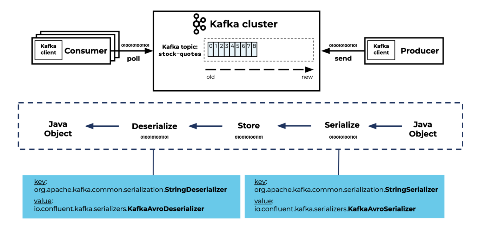

## Тестовый проект по Kafka.
Проект состоит из Producer'a(restApi) и Consumer'a, написанных на Spring, и брокера Kafka с хранилищем Zookeeper. Все сервисы и инфраструктура докеризированны с помощью Docker-compose.

### Поднять проект
1. git clone https://github.com/Polliver-hub/KafkaDemo.git
2. Убеждаемся что у нас локально установлены Docker и Gradle.
3. Идем сначала в Producer и в корневой директории собираем сервис командой - gradle build. Аналогичные действия проделываем с Consumer.
4. В корневой директории проекта запускаем compose: docker-compose up -d

### Руководство по использованию 
Документация по адресу - http://localhost:8080/swagger-ui/index.html 
Проект позволяет добавлять клиента в БД с помощью api(она же Producer) по адресу 8080 и передавать клиента по ID из БД на другой сервис-Consumer, через брокера Kafka.
